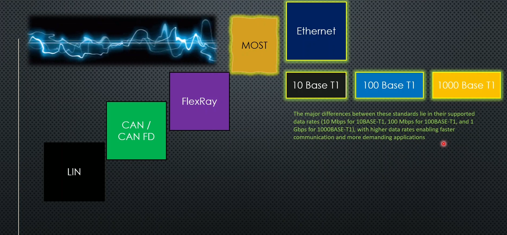
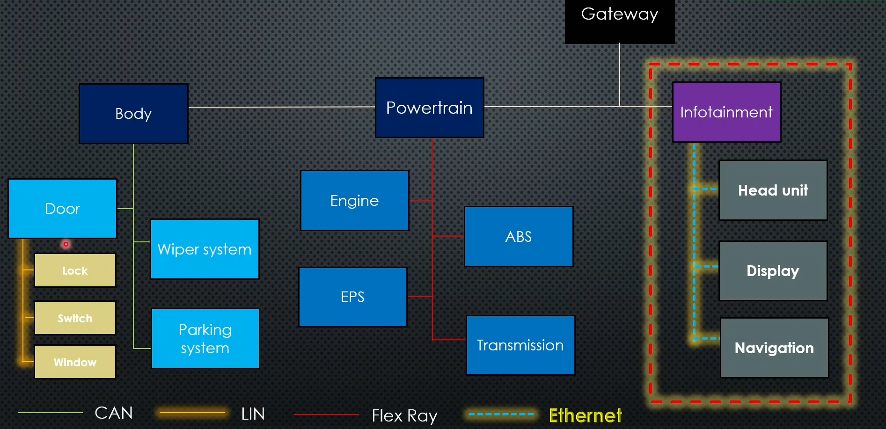
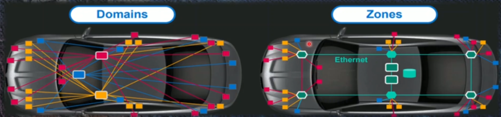
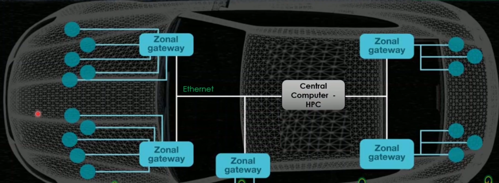
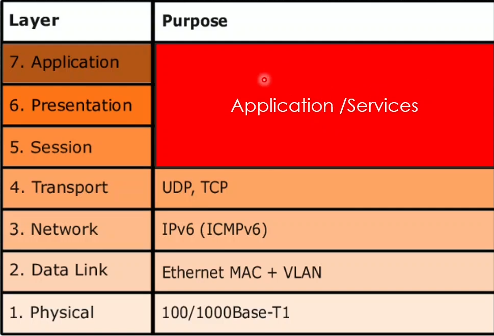
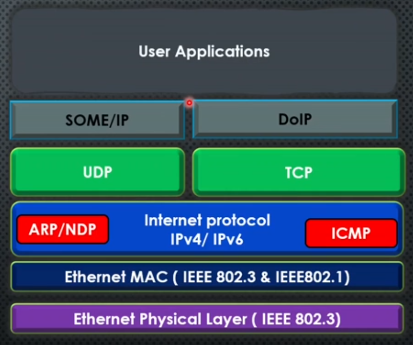
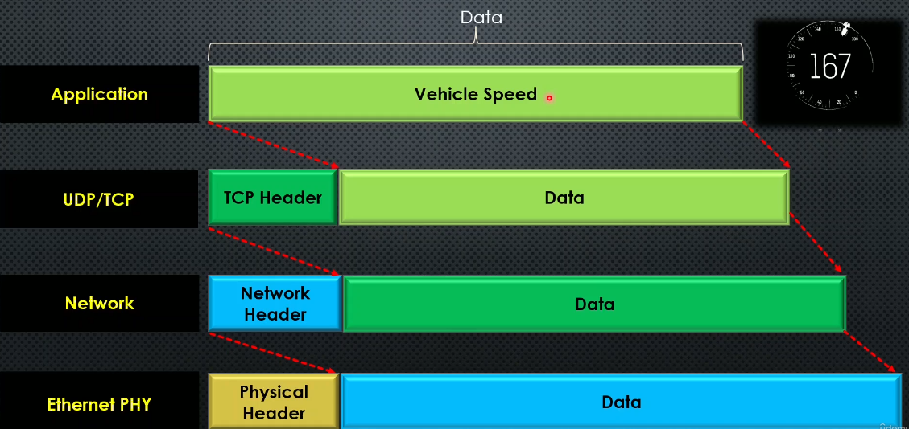
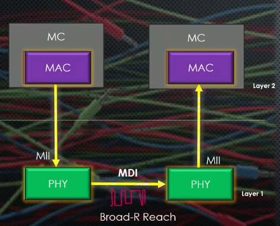

# Getting Started with Automotive Ethernet for Beginners Course

# Section 1 : Introduction

#### Communication Protocols - Automotive:

#### Lin: Local interconnect network

low cost , low speed  uses master slave topology

Speed 1.2-20 KB/Sec

Apps: Door modules , non critical functions .

#### CAN / CAN FD

Bus topolgy is used

Speed : 500KB/Sec - MB/S

APPS: Most common in AUTOMOTIVE , less in cost , better reliability

#### FlexRay

Speed 1MBps-10MBPS

Apps : High speed data sharing , Star topolgy , saftey critical functions

#### MOST : Media Oriented service transport

Speed 25-150MBPS

used for high speed multimedia.

#### Ethernet 

## Why Ethernet in Automotive?

**Domain Based Architecture:** 

**NOW : Moving to Zonal Based Architecture**

**Zonal Arch:** 

1. Every zone connected with its devices/sensors
2. All zones connected to Centeal Computer using Ethernet
3. Higher Speed , optimal data transmission
4. Reduction in wiring
5. SDV : Software Defined Vehicle Support  . making new features just depend on software not Hardware

   

# Section 2 : OSI , Ethernet Frame

## Automotive Ethernet : OSI LAYER (Open system interconnection model)

* **Physical Layer** : Deals with the transmission and reception of raw bitstreams over a physical medium.
* **Data Link Layer** : Handles node-to-node data transfer and error detection/correction.**Physical Addressing** : Using **MAC (Media Access Control) addresses** to identify devices on the same local network.
* **Network Layer** : Manages data routing, forwarding, and addressing (e.g., IP).
* **Transport Layer** : Ensures reliable data transfer and error recovery (e.g., TCP, UDP).
* **Session Layer** : Manages sessions or connections between applications.
* **Presentation Layer** : Translates data between the application layer and the network.
* **Application Layer** : Interfaces directly with user applications and provides network services.

## Automotive Ethernet : Data Frame

Let's imagine.

the rate of speed information is the data here when it moves within the ECU to the next layer, which is nothing but UDP or TCP the issue will add the TCP header on top of that along with the data. Then this becomes the packet. Then next layer is the network layer.

This is where the whole data will be added with the network header, so that it will be also going with different parts like three, four and six And then it comes to physical layer. The Ethernet file will add the physical header. So physical header along with the data will be sent out to the other issue over the physical wires.

# Section 3 : Automotive Ethernet : Physical Layer

The Mac is responsible for converting that digital data using Mii, and it converts that as a coded bitstream.

And PHY will convert that coded bitstream to electronic signals in order to transfer into the physical medium using MDI.

